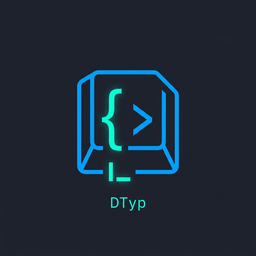

<p align="center">
  
</p>

# dTyp — Don't Tell Your Professor (VS Code Extension)

**dTyp** is an offline academic C programming library and automated character-by-character typing assistant for Visual Studio Code.

Contains over **1,000+ indexed academic C components** across 24 foundational computer science categories backed by an offline SQLite runtime.

---

## Features

- **Character-by-Character Typing**: Inserts code into your editor one character at a time at realistic typing speeds — never bulk pastes.
- **1,000+ Academic C Components**: Linked lists, binary search trees, AVL trees, graphs, sorting algorithms, dynamic programming, heaps, and numerical methods.
- **Topological Dependency Resolution**: Automatically resolves prerequisites (e.g. `quickSort` -> `partition` -> `swap`) and types them in correct order.
- **Duplicate Detection**: Inspects existing declarations in your open file to avoid re-inserting duplicate structs or functions.
- **100% Offline**: Includes a bundled SQLite database (`dtyp.db`). Zero external API calls or network access required.

---

## Command Syntax

Simply type `category>component()` in any `.c` or `.cpp` file:

```c
linkedList>createNode()
linkedList>insertAtBeginning()
sorting>quickSort()
stack>push()
queue>dequeue()
bst>insert()
graph>dijkstra()
dp>knapsack01()
numerical>bisectionMethod()
```

Typing `>` after any category name brings up rich autocomplete with function signatures, time/space complexity, and documentation.

---

## Extension Commands

Open the Command Palette (`Ctrl+Shift+P` / `Cmd+Shift+P`):
- `dTyp: Insert Component`: QuickPick search across 1,000+ components.
- `dTyp: Browse Library`: Category-by-category browser.
- `dTyp: Cancel Typing`: Halts ongoing character typing immediately.

---

## Extension Settings

- `dtyp.typingDelayMs`: Milliseconds delay per character (default: `15`).
- `dtyp.checkDuplicates`: When true, prevents inserting duplicate struct or function definitions (default: `true`).

---

## License

MIT License.
